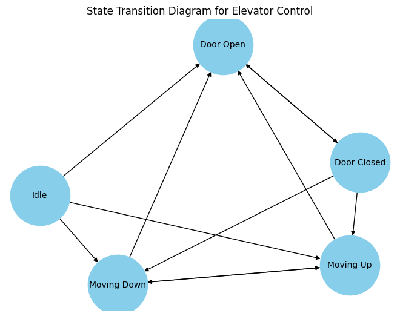

Покой (Idle): Лифт не двигается и двери закрыты.


Движется вверх (Moving Up): Лифт движется вверх.


Движется вниз (Moving Down): Лифт движется вниз.


Двери открыты (Door Open): Лифт остановился на этаже, и двери открыты.


Двери закрыты (Door Closed): Лифт остановился на этаже, и двери закрыты.
Мы можем выполнять следующие команды:


“Проехать этаж вверх”: Переводит лифт в состояние “Движется вверх”.


“Проехать этаж вниз”: Переводит лифт в состояние “Движется вниз”.


“Открыть двери”: Переводит лифт в состояние “Двери открыты”.


“Закрыть двери”: Переводит лифт в состояние “Двери закрыты”.


Лифт останавливается на этаже и открывает двери только в том случае, если на этом этаже нажата кнопка вызова, совпадающая с движением лифта. Каждый лифт обслуживает оба направления движения.


Таким образом, мы можем создать DFA, чтобы управлять состояниями и переходами лифта, обрабатывая команды от пользователей.



# Пример
**Ввод**
```commandline
    total_floors = 10
    elevator_positions = [1, 6, 3
    ]
    calls = [
        (4, 5),
        (9, 3),
        (2, 8),
        (6, 2)
    ]

```
**Вывод**

```commandline
Вызов 1: этаж 4 -> этаж 5. Назначен лифт 3.
Лифт 3 поднялся на этаж 4.
Лифт 3 открыл двери на этаже 4.
Лифт 3 закрыл двери на этаже 4.
Лифт 3 в режиме ожидания на этаже 4.
Лифт 3 поднялся на этаж 5.
Лифт 3 открыл двери на этаже 5.
Лифт 3 закрыл двери на этаже 5.
Лифт 3 в режиме ожидания на этаже 5.

Вызов 2: этаж 9 -> этаж 3. Назначен лифт 2.
Лифт 2 поднялся на этаж 7.
Лифт 2 поднялся на этаж 8.
Лифт 2 поднялся на этаж 9.
Лифт 2 открыл двери на этаже 9.
Лифт 2 закрыл двери на этаже 9.
Лифт 2 в режиме ожидания на этаже 9.
Лифт 2 спустился на этаж 8.
Лифт 2 спустился на этаж 7.
Лифт 2 спустился на этаж 6.
Лифт 2 спустился на этаж 5.
Лифт 2 спустился на этаж 4.
Лифт 2 спустился на этаж 3.
Лифт 2 открыл двери на этаже 3.
Лифт 2 закрыл двери на этаже 3.
Лифт 2 в режиме ожидания на этаже 3.

Вызов 3: этаж 2 -> этаж 8. Назначен лифт 1.
Лифт 1 поднялся на этаж 2.
Лифт 1 открыл двери на этаже 2.
Лифт 1 закрыл двери на этаже 2.
Лифт 1 в режиме ожидания на этаже 2.
Лифт 1 поднялся на этаж 3.
Лифт 1 поднялся на этаж 4.
Лифт 1 поднялся на этаж 5.
Лифт 1 поднялся на этаж 6.
Лифт 1 поднялся на этаж 7.
Лифт 1 поднялся на этаж 8.
Лифт 1 открыл двери на этаже 8.
Лифт 1 закрыл двери на этаже 8.
Лифт 1 в режиме ожидания на этаже 8.

Вызов 4: этаж 6 -> этаж 2. Назначен лифт 3.
Лифт 3 поднялся на этаж 6.
Лифт 3 открыл двери на этаже 6.
Лифт 3 закрыл двери на этаже 6.
Лифт 3 в режиме ожидания на этаже 6.
Лифт 3 спустился на этаж 5.
Лифт 3 спустился на этаж 4.
Лифт 3 спустился на этаж 3.
Лифт 3 спустился на этаж 2.
Лифт 3 открыл двери на этаже 2.
Лифт 3 закрыл двери на этаже 2.
Лифт 3 в режиме ожидания на этаже 2.

Результаты вызовов:
Вызов 1: Лифт 3 совершил 1 перемещений до открытия дверей на вызове.
Вызов 2: Лифт 2 совершил 6 перемещений до открытия дверей на вызове.
Вызов 3: Лифт 1 совершил 6 перемещений до открытия дверей на вызове.
Вызов 4: Лифт 3 совершил 4 перемещений до открытия дверей на вызове.
```